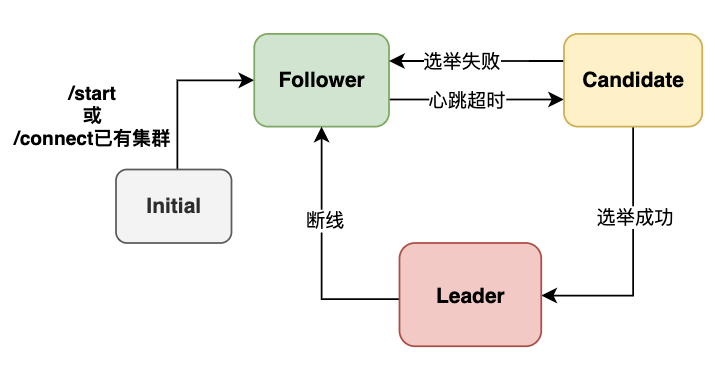
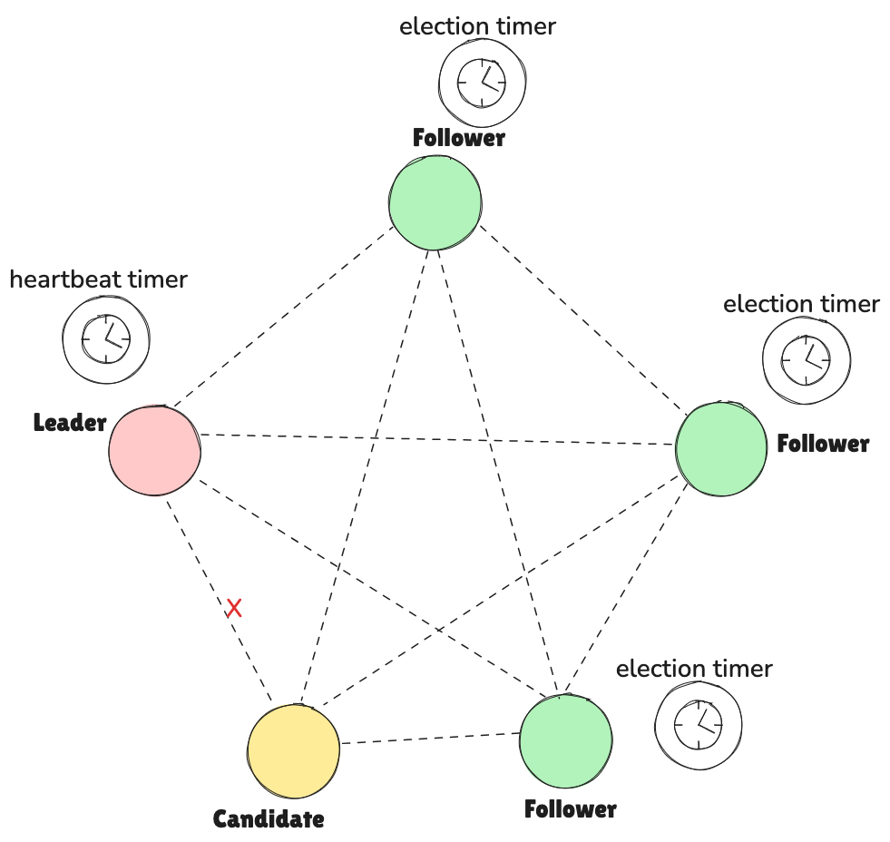
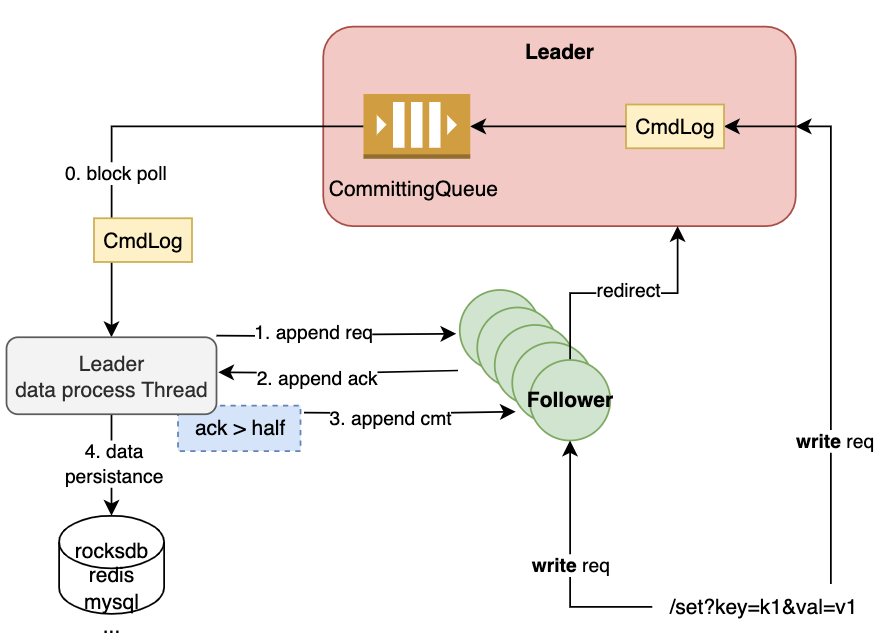

## WRaft是什么？

WRaft是一个Raft共识算法的MVP（Minimum Viable Product，最小可行产品）实现，**仅用作学习与交流，不建议直接用于生产**


## QuickStart

1. clone代码，mvn clean package 打包，target目录下获取jar包

2. 指定不同的端口，开启不同的节点

   1. ```bash
      java -Dserver.port=8081 -Dwraft.internal.port=10002 -Xms256m -Xmx256m  -jar /Users/admin/IdeaProjects/WRaft/target/WRaft-1.0-SNAPSHOT-exec.jar
      
      java -Dserver.port=8082 -Dwraft.internal.port=10003 -Xms256m -Xmx256m  -jar /Users/admin/IdeaProjects/WRaft/target/WRaft-1.0-SNAPSHOT-exec.jar
      
      java -Dserver.port=8083 -Dwraft.internal.port=10004 -Xms256m -Xmx256m  -jar /Users/admin/IdeaProjects/WRaft/target/WRaft-1.0-SNAPSHOT-exec.jar
      
      java -Dserver.port=8084 -Dwraft.internal.port=10005 -Xms256m -Xmx256m  -jar /Users/admin/IdeaProjects/WRaft/target/WRaft-1.0-SNAPSHOT-exec.jar
      
      java -Dserver.port=8085 -Dwraft.internal.port=10006 -Xms256m -Xmx256m  -jar /Users/admin/IdeaProjects/WRaft/target/WRaft-1.0-SNAPSHOT-exec.jar
      ```

3. 访问/connect接口，对节点进行连接，使其构成一个集群，此时集群还未对外服务

4. 访问/start接口，节点对外服务，内部会按照raft共识算法自主选主

5. 访问/state接口，查看集群状态以及data状态

6. 访问/set接口，增删改查k-v操作

7. 试图关闭部分节点，集群进行故障转移，k-v数据保证不丢


效果演示：

<video src="../../Downloads/演示.mov"></video>


## 核心原理

核心思想参考[Raft官网](https://raft.github.io/)，本实现完成了**故障转移**、**日志复制**两大特性，并提供数据持久化功能，数据持久化留有扩展接口，可以使用不同的持久化机制，默认采用**rocksdb**持久化。

以下从两大特性进行原理解析：

### 故障转移

按照Raft算法理论，当故障发生时，集群的节点会自动发起选举，整个故障转移过程有以下几个要点：

1. 集群中存在两个倒计时
   1. **选举**倒计时：每个非Leader节点都会有选举倒计时，且间隔时间为`baseElectionTime+random(0,randomRangeElection) ms`
   2. **心跳**倒计时：Leader节点有心跳倒计时，用于广播心跳包，间隔时间为`baseHeartTime+random(0,randomRangeHeart) ms`
   3. 心跳倒计时的间隔要小于选举倒计时，且需要将网络延迟考虑在内。即`(baseHeartTime+randomRangeHeart) - baseElectionTime > RTT`
2. 每个节点维护的有term，表示Leader任期
   1. 大term优先级高于小term，比如小term的Leader接收到大Term的Leader的心跳时，自动转为Follower，**并丢弃自己的数据转而同步全量数据**
   2. 每个Follower只对大于自己的term投票且只投第一票
   3. Candidate每次选举发起都会递增term
   4. Follower只响应大于等于自己term的心跳，并保持term同步
3. 选举采取**过半原则**，只有过半的Follower响应，此次term的选举才会成功

节点之间的状态流转示意图如下：




整个集群的节点示意图如下，节点之间是两两互联，**Leader不停的向所有节点发送心跳以维护自己的地位，Follower节点不停的进行选举倒计时，以应对随时到来的网络中断从而保证故障转移使得集群能正常工作。**




### 日志复制

日志操作的读对应集群的所有节点，写操作仅能由Leader处理，当请求到其余节点时，内部会进行请求**重定向**。一个完整的日志写入操作的流程是这样的：

1. 节点接收到写请求，若为非Leader节点，发起重定向事件
2. Leader节点接收到请求，将CmdLog放入CommttingQueue队列
3. Leader节点会有一个线程定期从队列头部获取CmdLog，周知所有Leader节点，发起CmdLog提交的三步骤，即对应三个事件
4. 当过半的Follower节点响应AppendLog后，开启提交，此时CmdLog从队列头部弹出，Leader处理下一个待提交日志

整个过程示意图如下：




### 事件驱动

WRaft底层使用Netty作为通信框架，基于事件驱动，定义的事件类型如下：

- 集群相关事件：
  - **CLUSTER_CONNECT**：节点之间进行连接，构建成一个集群
  - **START**：集群开启服务，各节点开启选举倒计时，会产生一个Leader
  - **HEART_BEAT**：用于Leader向Follower探活，并重置Follower的选举发起倒计时
  - **HEART_BEAT_RESP**：用于Follower响应心跳事件
  - **SHUT_DOWN**：节点下线通知，用于剔除节点本地集群状态维护的Channel
- 日志复制相关事件：
  - **REDIRECT**：非Leader节点接收到写操作，进行请求转发至Leader节点
  - **APPEND_LOG_REQ**：请求追加日志，日志复制的第一阶段
  - **APPEND_LOG_ACK**：Follower响应Leader提交的AppendLogReq，日志复制的第二阶段
  - **APPEND_LOG_CMT**：AppendLogReq接受过半之后，Leader发起最后的日志提交，此时Leader真正提交日志，数据被持久化，日志复制的第三阶段
  - **SYNC_ALL_DATA_REQ**：全量拉取数据，当Follower发现数据不一致时，会全量拉取数据
  - **SYNC_ALL_DATA_RESP**：全量数据同步返回，会搭载全量数据
- 故障转移相关事件：
  - **VOTE_REQ**：Follower在接受Heartbeat超时之后，将自己变更为candidate并广播选举请求
  - **VOTE_RESP**：Follower接收到Candidate做出的选举响应，每个term只响应一次且大于自身的term
  - **LEADER_CHANGE：Leader**变更通知，一种场景：当term小的Leader接收到大Term的Leader的心跳的时候，自己会变更为Follower，并发起该事件周知Leader变更。


通过以上的事件驱动，整个服务器的内部相当于一个有限状态机，逻辑处理三部曲为：接受事件、处理逻辑、产生新的事件

