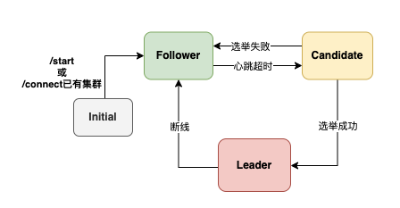

## WRaft是什么？

WRaft是一个Raft共识算法的MVP（Minimum Viable Product，最小可行产品）实现，**仅用作个人学习与交流，不用做实际生产！！！**


## QuickStart

1. clone代码，mvn clean package 打包，target目录下获取jar包

2. 指定不同的端口，开启不同的节点

   1. ```bash
      java -Dserver.port=8081 -Dwraft.internal.port=10002 -Xms256m -Xmx256m  -jar /Users/admin/IdeaProjects/WRaft/target/WRaft-1.0-SNAPSHOT-exec.jar
      
      java -Dserver.port=8082 -Dwraft.internal.port=10003 -Xms256m -Xmx256m  -jar /Users/admin/IdeaProjects/WRaft/target/WRaft-1.0-SNAPSHOT-exec.jar
      
      java -Dserver.port=8083 -Dwraft.internal.port=10004 -Xms256m -Xmx256m  -jar /Users/admin/IdeaProjects/WRaft/target/WRaft-1.0-SNAPSHOT-exec.jar
      
      java -Dserver.port=8084 -Dwraft.internal.port=10005 -Xms256m -Xmx256m  -jar /Users/admin/IdeaProjects/WRaft/target/WRaft-1.0-SNAPSHOT-exec.jar
      
      java -Dserver.port=8085 -Dwraft.internal.port=10006 -Xms256m -Xmx256m  -jar /Users/admin/IdeaProjects/WRaft/target/WRaft-1.0-SNAPSHOT-exec.jar
      ```

3. 访问/connect接口，对节点进行连接，使其构成一个集群，此时集群还未对外服务

4. 访问/start接口，节点对外服务，内部会按照raft共识算法自主选主

5. 访问/state接口，查看集群状态以及data状态

6. 访问/set接口，增删改查k-v操作

7. 试图关闭部分节点，集群进行故障转移，k-v数据保证不丢


<video src="../../Downloads/演示.mov"></video>


## 核心原理

## 

按照启动流程，其原理

1. 先启动应用，此时应用还是单机版
2. 访问/connect用于连接节点，进行节点连接，将节点两两相连构成一个集群，n个节点，连n-1次即可
3. 集群任一节点访问/start，整个集群开启服务（注意：开启服务之后，新加的节点必须是单个加入，其初始为空状态，不支持集群之间的合并，因为无法判断集群间日志的先后）
4. 开启服务之后，每个节点开启倒计时选举
   1. 初始term从1开始，随机时间为300-450ms，节点状态变为candidate，首先投票自己，并向其余节点拉票
   2. 投票开始前，建立快照：总票数
   3. 其余节点投票条件：
      1. 只投票比自己term大的
      2. 自己需要是candidate或者follower状态，leader状态的不参与投票
      3. 投票完之后
         1. 投票之后，不会重置candidate倒计时，即在选出leader之前，该节点也会发起选举，换句话说，新的leader产生之前（以心跳事件为准），任何节点都有参选的权利
         2. 如果投票时候，自己已经是candidate状态，此次选举不会被作废
         3. 如果是follower，则会等待投票结果
   4. 最先过半的节点，成为leader节点，停止选举调度，开启心跳调度。
      1. 心跳有几个作用，主要是维护集群的活性，心跳的间隔时间为150-300ms，小于投票倒计时300-450ms。	
         1. 接收到心跳的节点，判断心跳term是否大于等于自己，如果小于，则不回应
         2. 如果等于当前term，则正常回应
         3. 如果大于当前term，则说明是新的leader，则会更新自己的term和leader节点信息
         4. 在接受到心跳的时刻，需要重置自己的candidate倒计时（相当于被leader”平反“了一次“起义”）
   5. 心跳还有的作用为日志同步，这个在日志同步的时候再讨论
5. 每个节点都有几个状态：initial、follower、candidate、leader，某些行为具有状态限制，比如：
   1. leader不会响应拉票，直至新的leader产生被心跳信息修改term
6. 关于日志合并：
   1. 首先思考一个问题，两个不同的集群是否可以合并？如果可以，日志怎么合并？
      1. 先考虑分区问题，小分区的新日志用于不会提交，因为无法满足过半，因此恢复分区之后，直接合并是没问题的，因为小分区根本没有新增的日志。
      2. 而如果是完全不同的两个集群，term的时序与大小没有关联，因此无法进行合并。
      3. 所以做一个限制，connect的时候，如果有节点是非start状态，则
7. 访问/op开头的接口，进行节点状态变更，模拟各种状态
8. 访问/data开头的接口，进行节点数据改查


### 节点状态流转


